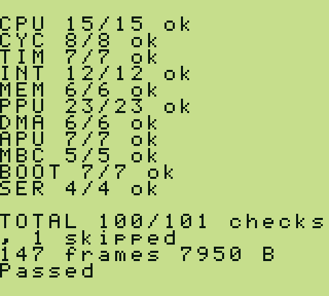
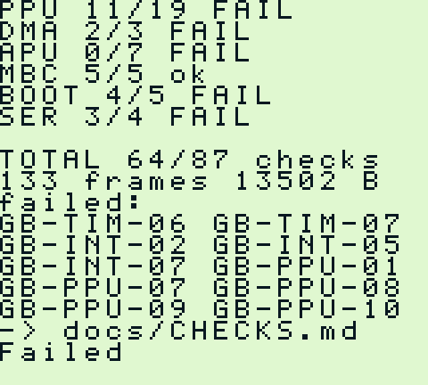

<p align="center">
  
</p>

<p align="center">
  <a href="LICENSE"></a>
  <a href="https://github.com/Alchemy86/GBSelfTest/actions/workflows/build.yml"></a>
  <a href="docs/CHECKS.md"></a>
</p>

<p align="center">
  
</p>

**Boot this on any emulator or on a real console, and it tells you what is broken
and where to read about it.**

One file. No host, no reference images, no setup: it runs 102 checks unattended and
reports the verdict twice over — as text on the screen, and as the same text out
of the link port so a machine can read it with nobody watching.

## When something is wrong

Every check has a **stable code**. It prints with the failure, it is the anchor on
a documentation page, and it never changes meaning. The screen lists the codes; the
link port carries the whole story, including the measured value, one line of
hardware explanation, and the URL to read.

<p align="center">
  
</p>

The same failure, as the link port sends it — verbatim, straight from the run that
took the picture above:

<!-- failure-excerpt -->
```
GB-CYC-07 FAIL an access lands on its own cycle
      got $00FF  want $0001
      -> the four-cycle read came out further than one tick from the three-cycle read at the same delay. They are one machine cycle apart and a tick is four, so the only differences possible are none and one
      -> https://github.com/Alchemy86/TerminalGB/blob/main/docs/gbselftest.md#gb-cyc-07
```
<!-- /failure-excerpt -->

That is the part nothing else in the ecosystem does. Other suites tell you a
number; this one tells you which behaviour is missing, in hardware terms an author
can act on, and where the write-up is. Every code is explained in
[`docs/CHECKS.md`](docs/CHECKS.md), under the same anchor the ROM prints — the URL
in the report points at the copy the consuming project keeps, and both pages are
generated from the cartridge's own registry so they cannot disagree.

The failure above is not injected for the picture. It is a real run of a real
emulator: Peanut-GB, which renders line by line and whose own README says to seek
an alternative if accuracy is what you need. See [the
scoreboard](#the-scoreboard).

## Running it

**Download [`dist/gbselftest.gb`](dist/gbselftest.gb), boot it, read the screen.**
That is the whole of it — no toolchain, no arguments, no host. On real hardware,
put it on a flash cart. In an emulator, load it. It finishes in under ten seconds
and stops on the verdict.

The cartridge header at `$0104-$0133` carries this project's own boot logo
(generated from AgentGB's `tools/boot_logo.py`, design `agent-bold`) rather than
the Nintendo logo. Real Game Boy boot ROMs compare that header against a
reference and refuse to hand off if it doesn't match — the original anti-piracy
lockout. None of the three implementations in [the scoreboard](#the-scoreboard)
enforce it (SameBoy's own boot ROMs skip the comparison outright, and
TerminalGB/Peanut-GB run this cartridge without executing a boot ROM at all), so
a clean run here does not establish that a stricter emulator or real hardware
would hand off to this cartridge.

For CI, capture the link port, which is what every Game Boy test-ROM runner
already does for Blargg's ROMs. The last line is `Passed` or `Failed`, on purpose
and by that convention, so an existing runner needs no changes:

```sh
tools/run-sameboy.sh dmg | tail -1        # -> Passed
```

The full transcript looks like
[`docs/screenshots/report-sameboy-dmg.txt`](docs/screenshots/report-sameboy-dmg.txt):

```
GBSelfTest v1
Every expectation below is either computed a second way on this
machine or is a documented hardware constant. None came from an emulator.
Every code below is a heading on https://github.com/Alchemy86/TerminalGB/blob/main/docs/gbselftest.md
console: DMG
handover: AF=01B0 BC=0013 DE=00D8 HL=014D SP=FFFE IF=E1

--- CPU: instruction behaviour and flags
GB-CPU-01 ok   ADD and ADC, against a counter-built adder
GB-CPU-02 ok   SUB, SBC and CP
GB-CPU-03 ok   AND, OR, XOR and CPL by identity
...
--- PPU: timing and the rendering fingerprint
GB-PPU-01 ok   a frame is 70224 cycles, measured against DIV
GB-PPU-02 ok   a scanline is 456 cycles
...

TOTAL 100/102 checks, 2 skipped
cost 147 frames, sent 8423 B
Passed
```

Three runners are here, one per implementation in the scoreboard. Each fetches and
pins its own emulator; nothing is vendored:

```sh
tools/run-sameboy.sh    dmg          # SameBoy, the reference
tools/run-terminalgb.sh identical    # TerminalGB, either picture mode
tools/run-peanut.sh                  # Peanut-GB
```

## The rule that makes the verdict worth anything

> **No check's expected value may be a number measured from an emulator.**

Every expectation here is either

* **computed a second, independent way on the machine itself** — the adder is
  checked against a counter built from `INC HL`, which sets no flags at all and
  goes through a different unit; the logic operations are checked against De
  Morgan's law; the rotates are checked by the fact that eight of them are the
  identity; `DAA` is checked against decimal arithmetic done a digit at a time; or
* **a documented constant that is a fact about the hardware** — a register's
  read-back mask, the published cycle count of an instruction, the 456 cycles in a
  scanline.

A behaviour that cannot be checked either way does not go in. It is listed as
untested instead, with the reason, in the coverage statement the cartridge prints
at the end of every run.

The other half of that rule is that the cartridge is **validated against
implementations nobody here wrote**. It is developed against three at once, and a
disagreement is investigated before anything ships — two of the checks in this
repository were wrong and were found that way, not by reasoning.

## The scoreboard

The same cartridge, the same hundred checks, two emulators:

<table>
<tr>
<th width="50%">SameBoy — the reference</th>
<th width="50%">Peanut-GB — built for speed</th>
</tr>
<tr>
<td></td>
<td></td>
</tr>
</table>

<!-- scoreboard -->
| implementation | result |
|---|---:|
| SameBoy, DMG | 100 / 102, 2 skipped |
| SameBoy, MGB (Pocket) | 100 / 102, 2 skipped |
| SameBoy, CGB-E | 97 / 102, 5 skipped |
| SameBoy, AGB | 98 / 102, 4 skipped |
| TerminalGB, per-dot renderer | 94 / 102, 2 skipped |
| TerminalGB, whole-scanline renderer | 86 / 102, 3 skipped |
| Peanut-GB | 68 / 102, 3 skipped |
<!-- /scoreboard -->

Measured 2026-08-24 with `tools/scoreboard.sh`, which runs every row and writes
[`docs/scoreboard.md`](docs/scoreboard.md); it names the exact revision of each
emulator it measured.

**This is evidence that the cartridge discriminates, not a league table.** A suite
everybody passes measures nothing, and the spread here is the property this project
exists to have. Every implementation in it is doing what it set out to do:
TerminalGB's two rows are the same emulator with two renderers behind it, and the
gap between them is the fetcher model alone — that project documents the trade and
gates on this exact list of codes. Peanut-GB is built to run a Game Boy on a
microcontroller, renders line by line, and its own README tells you to use
something else if accuracy is what you are after. The rows are not a ranking; they
are the range the checks can tell apart.

## What it checks

Eleven areas, 102 checks. The full list with explanations is
[`docs/CHECKS.md`](docs/CHECKS.md).

| area | what it is about |
|---|---|
| `CPU` | instruction results and every flag, by model and by identity |
| `CYC` | instruction and memory timing against the published cycle counts, and two checks that catch a **speed shortcut** — see below |
| `TIM` | the divider and the timer, including the write that clocks the timer |
| `INT` | the flags, `EI`'s delay and its latch, priority, the `HALT` defect, dispatch cost |
| `MEM` | the memory map: echo RAM, high RAM, ROM writes, sizes |
| `PPU` | display timing, bus blocking, the object-memory defect, and the **rendering fingerprint** — see below |
| `DMA` | the object transfer: what it copies and how long it takes |
| `APU` | sound registers, the length counter, the converters |
| `MBC` | banking, the bank-zero translation, cartridge RAM gating |
| `BOOT` | the state the boot ROM handed over at `$0100`, including the divider |
| `SER` | the link port's own registers and transfers |

### What it structurally cannot check

**The picture.** A cartridge cannot see it: the PPU streams pixels to the panel and
keeps none of them, so there is no framebuffer to read back and no way to judge one
from the inside. Pixel accuracy needs a host holding a reference image, and two
projects already do that properly — [the Mealybug Tearoom
tests](https://github.com/mattcurrie/mealybug-tearoom-tests) for the reference
images themselves, and [TerminalGB's conformance
tool](https://github.com/Alchemy86/TerminalGB/blob/main/docs/conformance.md) for
running suites like it at scale. Use those for that half. Being exact about the limit is what makes the rest
of this worth trusting.

Nor can it see anything finer than four dots — the CPU only observes on machine
cycle boundaries — or hear sound as sound; register behaviour and the length
counter are checked, what comes out of the speaker is not. The cartridge prints its
own coverage statement, including everything it deliberately leaves to Blargg,
Mooneye, SameSuite and the MBC suites, at the end of every run.

The same limit applies to Color hardware's double speed: `GB-CYC-09` and
`GB-PPU-07` check that the switch itself works and that the PPU's dot clock
does not speed up with the CPU, but a commit-timing bug that only changes
*which* tile a dot samples — the exact bug behind TerminalGB's `c575bb4` — is
purely a pixel, and no cartridge can read one. See
[`docs/double-speed.md`](docs/double-speed.md) for the survey and why.

### The rendering fingerprint

Rendering leaves a measurable trace even though the picture does not. **Mode 3
lasts exactly as long as the fetcher takes**, and the fetcher takes longer when
there is more to draw — a fine scroll offset, an object on the line, the window
starting. So the cartridge lays out a scene whose cost is documented and measures
how long mode 3 actually took. That is a real test of rendering behaviour with no
reference image anywhere in it, and in practice it is the most discriminating thing
here: it is what separates a renderer that draws a whole line at once from one that
models the fetcher.

The measurement works like this. The coincidence interrupt is armed on one scanline,
and the handler runs a variable number of `NOP`s before reading `STAT` once; a
binary search over that delay finds the exact machine cycle at which the mode
changes. The delay from the interrupt to the first `NOP` is unknown and does not
matter, because every result is the **difference** between two such edges and the
unknown cancels. The floor is four dots, because a machine cycle is four dots and
the processor cannot look between them.

### Catching a shortcut, not just a mistake

Most checks here look for something an emulator got wrong. Two look for something
it deliberately left out, and those are harder, because a good shortcut is exactly
one that keeps every total right.

An emulator that advances its peripherals once per instruction — or lets the
processor run a batch of them and advances everything afterwards — still runs every
clock at the correct rate. The frame is still 70224 cycles, the timer still ticks at
the documented rate, the interrupt is still delivered exactly once. Nothing measured
over a *run* of instructions can see the difference, which is why suites do not
catch it and why the emulators that do it can say so in their own documentation
without ever failing anything.

What gives it away is an observation that depends on **phase inside an instruction**
rather than on a rate:

- **`GB-CYC-07`** reads one register twice from the same starting phase, once with a
  three-cycle instruction and once with a four-cycle one. The reads land on
  different cycles of their own instructions, so over four one-cycle delays the
  longer instruction must overtake the shorter exactly once. Advance per instruction
  and both reads see the instruction's start, and it never overtakes.
- **`GB-CYC-08`** lets the timer overflow inside a sled of `NOP`s and has the handler
  read the return address off the stack, which names the instruction the interrupt
  landed on. Entering the sled one cycle later must move that landing back by exactly
  one instruction, eight times over. Deliver at a batch boundary and the landing
  stops moving.

Neither needs a reference, a host or a number measured from anything. They are the
cartridge doing the one job no external suite can do for you: telling you what your
speed cost.

## How long it takes

Under **ten seconds** on a Game Boy, measured end to end, and the checks are not
what costs it: the run waits on the display for 132 frames (2.2 s) and spends the
rest shifting the report out of the link port, which on a Game Boy runs at 8192
bits per second — 7.5 s for the 7,659 bytes of a passing DMG run. The report prints its own cost on the last line but one:

```
cost 147 frames, sent 7717 B
```

A host that only wants the verdict can stop as soon as it sees `Passed` or `Failed`.
A host that wants the report has to pay for it, and that is the right trade: the
explanations are the product.

## Building

Needs [RGBDS](https://rgbds.gbdev.io) and nothing else.

```sh
make                          # -> dist/gbselftest.gb
make RGBDS=/opt/rgbds-1.0.3   # if the tools are not on the path
make check                    # build twice and confirm the ROM is identical
```

The exact version releases are built with is pinned in
[`tools/fetch-rgbds.sh`](tools/fetch-rgbds.sh), and CI uses that script, so a
release is reproducible from source. The built ROM is committed to
[`dist/`](dist/) so that using it needs no toolchain at all.

Everything the documentation shows is regenerated rather than edited:
`tools/screenshots.sh` re-takes every picture from the emulators' own
framebuffers, `tools/scoreboard.sh` re-runs every row of the table, and
`tools/gen-docs.py` writes the check reference from the registry the ROM is built
from — CI fails if any of it has drifted.

## The cartridge

MBC1, four ROM banks, 8 KiB of cartridge RAM and **no battery** — so it can check
its own mapper and its own cartridge RAM, and it can never leave a save file beside
itself. Each switchable bank begins with its own number, which is how the mapper
checks tell which bank they actually got: the answer comes out of the cartridge's
own contents rather than from anything an emulator says about itself.

## Contributing a check

A check earns its place by being all four of these:

1. **Self-verifying.** Its expected value is computed on the machine or is a
   documented hardware constant. If you had to measure it on an emulator to find
   out what it should be, it does not go in.
2. **Discriminating.** A careful implementation and a rough one give different
   answers. Everything passing it is a check that measures nothing.
3. **Explained.** One line saying what behaviour is missing, in hardware terms,
   that an author can act on. A check that only says `FAIL` is half a check.
4. **Bounded.** It cannot hang. Anything that waits for an event waits with a
   limit, and anything that waits for an event a broken machine might never deliver
   checks first that the machine can deliver it, and skips if not.

In practice that is: add the routine to the right `src/checks_*.asm`, add its code,
name and one-line explanation to [`src/registry.asm`](src/registry.asm), run
`tools/gen-docs.py` so the reference page and the anchors follow, and rebuild. Then
run it against at least one implementation nobody here wrote — `tools/run-*.sh`
will fetch you three — and if it disagrees, find out who is right before shipping.

## Licence and contents

MIT — see [`LICENSE`](LICENSE). Everything here is original: the font is drawn for
this cartridge, the [brand](docs/brand/README.md) is drawn as stroked paths with no
font embedded or traced, the register definitions are written out from Pan Docs
(which is public domain), and there is no third-party source, no boot-ROM extract
and no game data of any kind. That is deliberate: the point is that anybody can
take it, ship it, and modify it.
